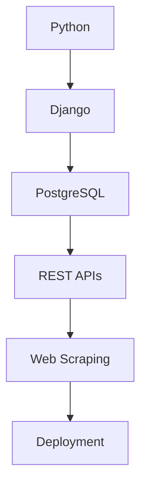

# 👋 Hello, I'm Ehab Ahmed 

**Django Developer | Python Enthusiast | Web Solutions Creator**

Welcome to my GitHub profile! I'm a backend-focused developer passionate about building functional web applications with Django. Here you'll find my projects, skill development path, and ways to connect with me.

## 🔭 Current Focus
- 🧩 Mastering Django ORM patterns  
- ⚙️ Building RESTful APIs with Django REST Framework  
- 🕸️ Improving web scraping techniques  
- 🚀 Deployment best practices  

## 🛠️ Technical Skills
- **Backend**: Django, Django ORM, Django REST Framework  
- **Databases**: PostgreSQL, SQLite  
- **Web**: HTML5, CSS3, RESTful APIs  
- **Tools**: BeautifulSoup, Selenium, Requests  
- **Deployment**: PythonAnywhere, Railway  
- **Version Control**: Git & GitHub  

## 🏆 Featured Projects
### 1. Culture Bridge
  
**Tech Stack**: Django  
• HTML/CSS/JS
- Culturally Intelligent AI Integration  
- End-to-End Full-Stack Development 
- Scalable SaaS Architecture  
- User-Centric Social Media Utility
Focused on usability and real-world social media workflows,

### 2. HoubaStore – E‑commerce Platform  
  
**Tech Stack**: Django • PostgreSQL • HTML/CSS  
- User authentication system  
- Product catalog with categories  
- Admin dashboard for management  
- Shopping cart functionality  

### 3. Blog CMS  
 
**Tech Stack**: Django • SQLite • HTML/CSS  
- Role-based access (Admin/Author/User)  
- Content management system  
- Post creation/editing workflows  

### 4. Job Scraper  
**Tech Stack**: Python • BeautifulSoup • Requests  
- Multi-site job extraction  
- Data cleaning and structuring  
- CSV export functionality  

## 📬 Let's Connect!
- ✉️ **Email**: ihapbpc@gmail.com  
- 💼 **LinkedIn**: [My LinkedIn](https://www.linkedin.com/in/ehab-ahmed-9467741b3/)  
- 🌐 **Portfolio**: [My Portfolio](https://ehabahmed0.pythonanywhere.com/)  

## 📊 GitHub Stats

